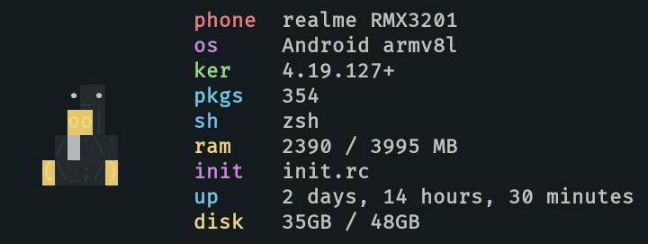

<h2 align="center"> Everblush Termux </h2>


<p>
  <h4 align="center">
    <i>Everblush Port for Termux</i>
  </h4>
</p> 

<p align="center">
  
  
  
  
</p>

## Preview


## Installation
Put ```colors.properties``` in ```$HOME/.termux/```

## Credits 💝
- [pluffie](https://github.com/pluffie)

